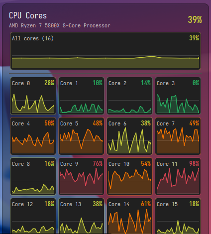

# 🧠 CPU Core Monitor

       

## ✨ Overview

See how hard every logical CPU core is working, directly from your KDE Plasma 6 panel. A
colour-coded circular gauge tracks total usage at a glance; open the popup for a grid of
per-core trend graphs. No daemons, no dependencies — just `/proc/stat`.


***Circular panel gauge — colour and ring follow total CPU usage***


***Popup with a trend graph per core, plus the combined all-cores graph***

## 🎯 Features

### 📊 Panel Gauge
- **Circular gauge** with a ring that tracks the exact total usage percentage
- **Four colour bands** that follow load across all cores:
  - 🟢 **green** — below 15%
  - 🟡 **yellow** — 15% to 40%
  - 🟠 **orange** — 40% to 75%
  - 🔴 **red** — 75% and above
- **Total usage percentage** next to the icon (optional) and in the tooltip, alongside the
  core count and CPU model

### 📈 Per-Core Graphs
- **One graph per logical core**, each showing the trend over the last 10 seconds plus the
  current percentage, tinted with the same four colour bands
- **Combined all-cores graph** above the grid (optional)
- **Hover for detail** — minimum, average, and maximum over the graphed window
- **Time-accurate plotting** — points are drawn against their timestamps, not their index

### ⚙️ Customization
- **Colour thresholds** — the usage percentages at which cores turn yellow, orange, and red
- **Graph columns** (automatic, or 1–8) and **graphed trend** length in seconds
- **Split sampling rates** for popup-open (ms) and popup-closed (seconds) states, so a CPU
  monitor never becomes a meaningful CPU consumer of its own

## 📋 Requirements

### Minimum Requirements
- **Desktop Environment**: KDE Plasma 6 (developed against 6.7)
- **Toolkit**: KF6 / Qt 6
- **Kernel Interface**: Linux with `/proc/stat` — no other dependencies

### Optional Dependencies
- `plasma-sdk` — provides `plasmoidviewer` for standalone development runs

## 🚀 Installation

### Quick Install

```bash
# Install or upgrade
./install.sh

# Uninstall
./install.sh remove
```

The script wraps `kpackagetool6`. After installing, add **CPU Core Monitor** from the
panel's *Add Widgets* menu. If the widget was already on the panel, reload Plasma:

```bash
kquitapp6 plasmashell && kstart plasmashell
```

### From Source

```bash
git clone https://github.com/danielmdecker/cpucoremon-kde.git
cd cpucoremon-kde
./install.sh
```

## ⚙️ Configuration

Right-click the widget → *Configure*:

| Setting | Description |
| --- | --- |
| **Show total usage percentage** | Display the combined figure next to the panel icon |
| **Show combined graph** | Add an all-cores trend graph above the per-core grid |
| **Graph columns** | Automatic, or a fixed 1–8 |
| **Graphed trend** | Length of the trend window in seconds (default 10) |
| **Sampling rate (open)** | Poll interval while the popup is open, in milliseconds |
| **Sampling rate (closed)** | Poll interval while the popup is closed, in seconds |
| **Colour thresholds** | Usage percentages at which cores turn yellow, orange, and red |

## 🔍 How It Works

- Usage comes from `/proc/stat`: each sample diffs the per-CPU jiffy counters against the
  previous one, so a core's percentage is its share of non-idle time since the last sample
  (`idle` and `iowait` both count as idle). The first reading after the popup opens is
  blank until a second sample arrives.
- Graph points are plotted against their timestamps rather than their index, so the trend
  stays honest to the configured window even when the sampling rate changes.
- The trend history is reset when the popup opens: the coarse samples taken while it was
  closed would otherwise show up as a flat run across the graph.
- Cores are the logical CPUs the kernel reports (`cpu0`, `cpu1`, …), so an 8-core CPU with
  SMT shows 16 graphs.

## 🐛 Troubleshooting

### Common Issues

#### 🔴 Panel gauge stuck at 0%
- **Check the source**: `cat /proc/stat` should print `cpu` lines in a terminal
- **Verify Plasma 6**: `plasmashell --version` — the widget needs Plasma 6.0 or newer
- **Data engine**: the widget reads `/proc/stat` through Plasma's executable data engine

#### 🟡 Popup graphs are empty
- **Needs two samples**: at the default 500 ms rate the trace appears within a second
- **Sampling rate too slow**: lower the popup-open interval in the configuration

#### 🟢 Too many graphs to read comfortably
- **Set a fixed column count** instead of automatic
- **Turn off the combined graph** to reclaim vertical space

#### 🔵 Widget missing after install
- **Reload Plasma**: `kquitapp6 plasmashell && kstart plasmashell`
- **Confirm registration**: `kpackagetool6 -t Plasma/Applet -l | grep cpucoremon`

### Getting Help
- **System logs**: `journalctl -xe`
- **QML output**: `QT_FORCE_STDERR_LOGGING=1 plasmoidviewer -a ./package`
- **GitHub Issues**: [Open an issue](https://github.com/danielmdecker/cpucoremon-kde/issues)
- **KDE Forums**: [KDE Plasma forums](https://discuss.kde.org/)

## 💡 Tips & Tricks

- **Keep it cheap**: raise the popup-closed sampling interval — the panel gauge still stays
  current, and the widget costs almost nothing while you are not looking at it.
- **Tune the bands**: on a machine that idles warm, raising the yellow threshold keeps the
  panel calm until something is genuinely busy.
- **Spot a runaway thread**: a single core pinned at 100% while the rest idle is the classic
  single-threaded-loop signature — the per-core grid makes it obvious at a glance.
- **Match your panel**: a fixed column count that mirrors your core topology (e.g. 8 columns
  for 8 physical cores with SMT) lines SMT siblings up in pairs.

## 🔨 Development

Install the Plasma SDK to get `plasmoidviewer` for rapid iteration:

```bash
sudo pacman -S plasma-sdk          # Arch / CachyOS
plasmoidviewer -a ./package        # run the widget in a standalone window
```

`plasmoidviewer` sends QML `console` output to the journal; to see it on stderr, run it as
`QT_FORCE_STDERR_LOGGING=1 plasmoidviewer -a ./package`.

### Project Structure

```
cpucoremon-kde/
├── package/
│   ├── contents/
│   │   ├── config/        # config.qml, main.xml — settings schema and pages
│   │   ├── icons/         # cpucoremon.svg
│   │   └── ui/            # main.qml, FullRepresentation.qml, CoreDelegate.qml,
│   │                      # configGeneral.qml
│   └── metadata.json      # Plasmoid metadata
├── screenshots/           # README imagery
├── install.sh             # Install / upgrade / remove wrapper for kpackagetool6
└── README.md              # This file
```

### Development Guidelines
- Follow KDE coding standards and Kirigami styling conventions
- Use Kirigami semantic theme colours so the widget adapts to light and dark schemes
- Keep the popup-closed sampling path cheap — it runs all the time
- Test against Plasma 6 with `plasmoidviewer` before installing

## 📝 Changelog

### Version 0.1.0 — Initial release
- Circular panel gauge with four colour bands tracking total CPU usage
- Per-core trend graphs with hover min/average/max detail
- Optional combined all-cores graph and total usage label
- Configurable thresholds, graph window, column count, and sampling rates
- Split sampling rates for popup-open and popup-closed states

## 📄 License

This project is licensed under the MIT License.

## 🤝 Contributing

Contributions are welcome! Please feel free to submit a Pull Request.

### How to Contribute
1. Fork the repository
2. Create your feature branch (`git checkout -b feature/amazing-feature`)
3. Commit your changes (`git commit -m 'Add amazing feature'`)
4. Push to the branch (`git push origin feature/amazing-feature`)
5. Open a Pull Request

### Code of Conduct
Please be respectful and constructive in all interactions.

## 📧 Contact

- **Author**: Daniel M. Decker
- **Repository**: [cpucoremon-kde](https://github.com/danielmdecker/cpucoremon-kde)
- **Issues**: [Open an issue](https://github.com/danielmdecker/cpucoremon-kde/issues)

## 🙏 Acknowledgments

- [KDE Plasma](https://kde.org/) — for the beautiful desktop environment
- The Linux kernel's `/proc/stat` interface — small, stable, and exactly enough
- The KDE community for continuous support and feedback

## 📊 Statistics


---

Made with ❤️ for the KDE community

[⬆ Back to Top](#-cpu-core-monitor)
